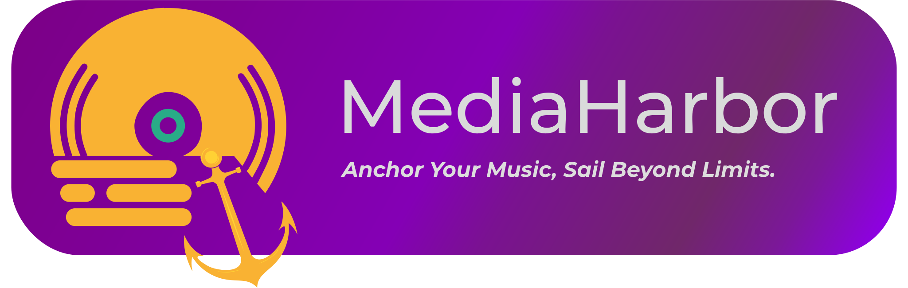

# MediaHarbor Desktop

  


# If you're getting ENONENT errors, please install pip packages manually

## Downloading
### YouTube / YouTube Music
#### pip install yt-dlp
### Spotify
#### pip install git+https://github.com/mediaharbor/custom_votify.git
### Qobuz / Tidal / Deezer
#### pip install git+https://github.com/mediaharbor/custom_streamrip.git
### Apple Music
#### pip install git+https://github.com/mediaharbor/custom_gamdl.git
## Searching
### YouTube 
#### pip install googleapi
### YT Music
#### pip install ytmusicapi
### Apple Music
#### pip install pyapplemusicapi


MediaHarbor is your all-in-one media downloader, supporting audio and video downloading / streaming from platforms like YouTube and more—all through an intuitive, streamlined interface.

## Installation
You can download and install MediaHarbor from releases page for your OS

## Table of Contents
- [Features](#features)
- [Known Issues](#known-issues)
- [Installation](#installation)
- [Usage](#usage)
- [Contributing](#contributing)
- [License](#license)

## Features
- Download audio & video from popular platforms
- Seamless integration with yt-dlp
- Built-in search across YouTube, Spotify, and more
- Editing configuration files in app

## Known Issues

- Batch downloads can flicker until they finish.
- Play buttons on search page are limited to Videos, Tracks, and Podcasts only.
- Can't handle all errors on Downloading.

## Building

### Prerequisites
- Node.js
- npm

### Clone the Repository

```bash
git clone https://github.com/MediaHarbor/mediaharbor.git
cd mediaharbor
```

### Install Dependencies

```bash
npm install
```


## Usage

To start the application, run:

```bash
npm run start
```

To build the application:

```bash
npm run build
```
## Manual installation for first start
You can find which packages MH currenly uses at [MANUELINSTALL.MD](MANUELINSTALL.MD).
## Contributing
All contributions are welcome! Please read the contributing guidelines in the [CONTRIBUTING.md](CONTRIBUTING.md) file.

## License
This project is licensed under the GPL 3.0 - see the [LICENSE](LICENSE) file for details.