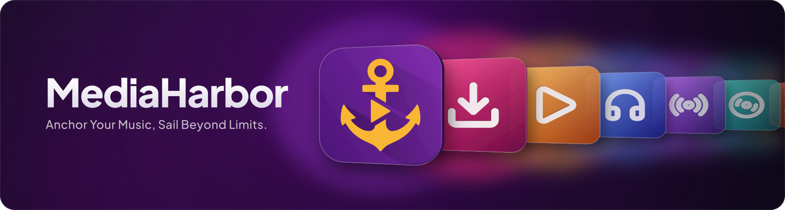
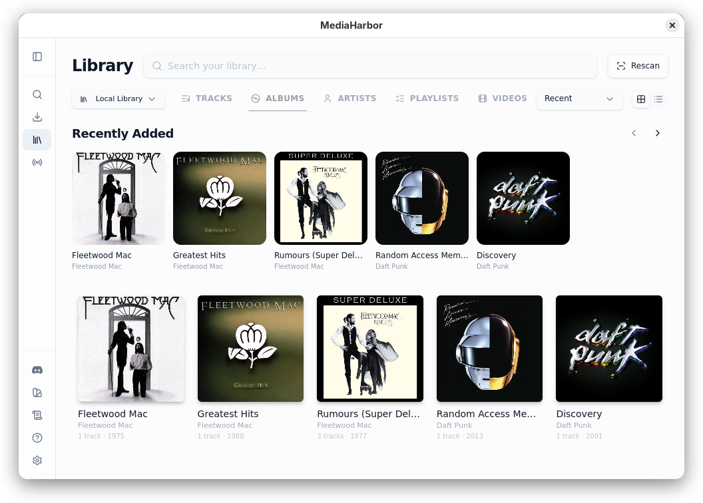

# MediaHarbor

MediaHarbor is a desktop app for Windows, macOS and Linux that searches, plays and downloads music from Spotify, Apple Music, Tidal, Qobuz, Deezer, YouTube and YouTube Music, plus anything yt-dlp can fetch. It also manages your local music library and plays internet radio.

[](https://github.com/MediaHarbor/mediaharbor/releases/latest)
[](https://github.com/MediaHarbor/mediaharbor/actions/workflows/ci.yml)
[](https://github.com/MediaHarbor/mediaharbor/releases)
[](https://flathub.org/apps/org.mediaharbor.MediaHarbor)
[](LICENSE)
[](https://discord.gg/Kc97D86TeZ)

[Website](https://mediaharbor.org) · [Download](https://github.com/MediaHarbor/mediaharbor/releases/latest) · [Changelog](CHANGELOG.md) · [Report a bug](https://github.com/MediaHarbor/mediaharbor/issues/new?template=bug_report.md)



## Contents

- [Features](#features)
- [Supported services](#supported-services)
- [Installation](#installation)
- [Setup](#setup)
- [Verifying a release](#verifying-a-release)
- [Building from source](#building-from-source)
- [Known limitations](#known-limitations)
- [Contributing](#contributing)
- [Disclaimer](#disclaimer)
- [License](#license)

## Features

- **One search for every service.** Search Spotify, Apple Music, Tidal, Qobuz, Deezer, YouTube and YouTube Music from one place, and open albums, artists and playlists as full pages.
- **Downloads in the service's own quality.** FLAC up to 24-bit/192 kHz from Tidal and Qobuz, FLAC from Deezer, AAC from Spotify, and AAC or Dolby Atmos from Apple Music. Files are tagged with cover art, and tracks you already downloaded from the same service are skipped.
- **Any link yt-dlp understands.** Paste a URL from YouTube, SoundCloud or hundreds of other sites and save it as audio or video. No account needed.
- **A native audio player.** Crossfade, replay gain, output device selection, visualizers, synced lyrics, autoplay and OS media controls (MPRIS, Windows, macOS). It plays FLAC, ALAC, WAV, AIFF, MP3, AAC and HE-AAC, Opus, Vorbis, Monkey's Audio (APE), Musepack, Speex and TTA.
- **One library for your files and your accounts.** Local music is indexed in SQLite, with a tag editor, play history, and playlists that import and export M3U. Saved albums, artists, playlists and home feeds from each service sit next to it, and saves, follows and playlist edits go back to the service.
- **Internet radio.** Browse Radio Browser, SomaFM and the Icecast directory, keep favourites and custom lists, and import stations from a stream URL, a playlist file or an Icecast server.
- **Guided setup.** Onboarding asks which services you use, the Dependencies page installs the tools they need, and every saved sign-in is checked in the background.
- **In-app updates** for the Windows, macOS, AppImage, deb and rpm builds.

## Supported services

| Service | Downloads | Playback | Lyrics | Sign-in |
|---|---|---|---|---|
| Spotify | AAC up to 256 kbps; FLAC or Vorbis with the votify backend | ✓ | ✓ | Cookies file, then **Login with Spotify**, plus a `.wvd` file |
| Apple Music | AAC, HE-AAC, Dolby Atmos; ALAC with [wrapper-v2](https://github.com/glomatico/wrapper-v2) | ✓ | ✓ | Cookies file and a `.wvd` file |
| Tidal | FLAC up to 24-bit/192 kHz | ✓ | ✓ | In-app sign-in, or import a token |
| Qobuz | FLAC up to 24-bit/192 kHz | ✓ | — | In-app sign-in, or user ID and auth token |
| Deezer | FLAC or MP3 | ✓ | ✓ | ARL cookie |
| YouTube, YouTube Music | Audio or video through yt-dlp | ✓ | YouTube Music only | Optional cookies |
| Internet radio | — | ✓ | — | None |
| Other yt-dlp sites | Audio or video | — | — | None |

Everything except other yt-dlp sites can be searched inside the app; for those, paste a link. [OrpheusDL](https://github.com/OrfiTeam/OrpheusDL) can be added as an extra download backend, with modules for services such as Beatport and SoundCloud.

## Installation

Download the file for your system from the [latest release](https://github.com/MediaHarbor/mediaharbor/releases/latest).

Upgrading from 2.x? Your settings are migrated on first launch, but Spotify playback now needs a `.wvd` file and the Spotify dependency. Read the [changelog](CHANGELOG.md) before you update.

### Windows

Run `MediaHarbor_<version>_x64-setup.exe`, or use `MediaHarbor_<version>_x64_en-US.msi` if you deploy with MSI. Both update from inside the app.

The installers are not code-signed, so SmartScreen warns about an unknown publisher. Choose **More info → Run anyway**. To be sure of what you are running, check the download against `SHA256SUMS.txt` first (see [Verifying a release](#verifying-a-release)).

### macOS

Download `MediaHarbor_<version>_aarch64.dmg` for Apple Silicon or `MediaHarbor_<version>_x64.dmg` for Intel, and drag MediaHarbor to Applications.

MediaHarbor is not notarized, because that needs a paid Apple Developer ID the project doesn't have yet. macOS quarantines the app on first launch, so clear the flag once:

```sh
xattr -dr com.apple.quarantine /Applications/MediaHarbor.app
```

Updates installed from inside the app are not quarantined again.

### Linux

| Package | Install | Updates |
|---|---|---|
| [Flathub](https://flathub.org/apps/org.mediaharbor.MediaHarbor) | `flatpak install flathub org.mediaharbor.MediaHarbor` | `flatpak update` |
| [AUR](https://aur.archlinux.org/packages/mediaharbor) | `paru -S mediaharbor` (builds from source), or the community-maintained [`mediaharbor-bin`](https://aur.archlinux.org/packages/mediaharbor-bin) | Your AUR helper |
| Debian, Ubuntu | `sudo apt install ./MediaHarbor_*_amd64.deb` | In the app |
| Fedora, RHEL | `sudo dnf install ./MediaHarbor-*.x86_64.rpm` | In the app |
| AppImage | `chmod +x MediaHarbor_*_amd64.AppImage`, then run it | In the app |
| Flatpak bundle | `flatpak install --user MediaHarbor-x86_64.flatpak` (or `-aarch64`); needs the Flathub remote for its runtime | Install the next bundle |

The `.deb`, `.rpm` and AppImage are built for x86_64. The Flatpak runs on x86_64 and aarch64.

## Setup

On first launch, onboarding asks which services you use. You can skip them all and just paste links; each service you add gets its own tab in **Settings**.

### Dependencies

The **Dependencies** page in the sidebar installs and updates the tools MediaHarbor runs. They go into MediaHarbor's own folder and Python environment, so your `PATH` and shell profile are never edited. Tools already installed on your system are detected and used.

| Dependency | What it's for |
|---|---|
| Python 3.10+ | Required. Runs yt-dlp, votify and gamdl in MediaHarbor's own environment |
| FFmpeg | Required. Converts and remuxes audio and video |
| yt-dlp | Required. Downloads and streams YouTube, YouTube Music and other sites |
| Spotify (votify and pywidevine) | Spotify playback and downloads |
| Apple Music (gamdl) | Apple Music downloads with the gamdl backend |
| Deno | Solving YouTube's JavaScript challenges in yt-dlp |
| aria2c | Faster, multi-connection yt-dlp downloads |
| N_m3u8DL-RE | Faster HLS downloads for gamdl |
| Bento4 | Only votify's `mp4decrypt` remux mode |
| OrpheusDL and modules | An optional extra download backend |

### Accounts

Add a service in **Settings** and sign in on its tab; the [Supported services](#supported-services) table lists what each one needs. A status pill on the tab shows whether the saved sign-in still works. MediaHarbor re-checks it every 15 minutes and after a sign-in error.

Spotify and Apple Music protect their audio with Widevine, so both need a Widevine device file (`.wvd`) that you set in their Settings tab. MediaHarbor does not ship one. Apple Music ALAC also needs a [wrapper-v2](https://github.com/glomatico/wrapper-v2) daemon that you run yourself; MediaHarbor connects to it but cannot install or start it.

### Flatpak

The Flatpak installs its tools the same way every other build does, into MediaHarbor's own folder. Only OrpheusDL is unavailable there, because it needs git.

## Verifying a release

Every release file is hashed in `SHA256SUMS.txt`, and that list is GPG-signed as `SHA256SUMS.txt.asc`. Checking the signature on the list therefore checks every file in it.

```sh
# one-time: import the release signing key
curl -fsSL https://raw.githubusercontent.com/MediaHarbor/mediaharbor/main/packaging/keys/mediaharbor-release.asc | gpg --import

# check the list's signature, then your downloads against it
gpg --verify SHA256SUMS.txt.asc SHA256SUMS.txt
sha256sum --ignore-missing -c SHA256SUMS.txt
```

On older macOS versions without `sha256sum`, run `shasum -a 256 --ignore-missing -c SHA256SUMS.txt`. On Windows, compare the output of `Get-FileHash <file>` in PowerShell with that file's line in `SHA256SUMS.txt`.

Release signing key fingerprint:

```
4E7E D764 DFB4 F1B6 59C1  C570 DD7A E5F9 C20A 4047
MediaHarbor Release Signing <info@mediaharbor.org>
```

The RPM also carries an embedded signature:

```sh
sudo rpm --import https://raw.githubusercontent.com/MediaHarbor/mediaharbor/main/packaging/keys/mediaharbor-release.asc
rpm --checksig MediaHarbor-*.rpm
```

Every file also has a [Sigstore build-provenance attestation](https://docs.github.com/en/actions/how-tos/secure-your-work/use-artifact-attestations/use-artifact-attestations), which proves it was built by this repository's release workflow and not rebuilt elsewhere:

```sh
gh attestation verify <file> --repo MediaHarbor/mediaharbor
```

## Building from source

### Prerequisites

1. [Node.js](https://nodejs.org/) 24 or later, with npm.
2. Rust stable through [rustup](https://rustup.rs/); `rust-toolchain.toml` pins the channel and components:

   ```sh
   curl --proto '=https' --tlsv1.2 -sSf https://sh.rustup.rs | sh
   ```

   On Windows, run `winget install Rustlang.Rustup` or download `rustup-init.exe` from [rustup.rs](https://rustup.rs/) instead.

3. The Tauri CLI as a Cargo subcommand, because the npm scripts run `cargo tauri`:

   ```sh
   cargo install tauri-cli --version "^2" --locked
   ```

4. The system packages for your OS, below.

#### Linux

On Fedora:

```sh
sudo dnf install gcc gcc-c++ make pkg-config libatomic \
  glib2-devel gtk3-devel webkit2gtk4.1-devel libsoup3-devel openssl-devel \
  alsa-lib-devel pipewire-devel clang-devel llvm-devel
```

On Debian or Ubuntu:

```sh
sudo apt install build-essential pkg-config libssl-dev \
  libgtk-3-dev libwebkit2gtk-4.1-dev libsoup-3.0-dev libappindicator3-dev librsvg2-dev patchelf \
  libasound2-dev libpipewire-0.3-dev libspa-0.2-dev clang libclang-dev
```

To build the Flatpak as well, install `flatpak` and `flatpak-builder`.

#### macOS and Windows

Follow the [Tauri prerequisites](https://tauri.app/start/prerequisites/): the Xcode Command Line Tools on macOS, and the Microsoft C++ Build Tools with WebView2 on Windows.

### Build and run

```sh
git clone https://github.com/MediaHarbor/mediaharbor.git
cd mediaharbor
npm ci
npm run tauri:dev
```

`tauri:dev` starts the Vite dev server and the app together, with hot reload for the frontend.

For a production build, run one of these:

| Command | Produces |
|---|---|
| `npm run tauri:build` | Every bundle for your OS |
| `npm run tauri:build:linux` | `.deb`, `.rpm` and AppImage |
| `npm run tauri:build:win` | `.msi` and the NSIS `.exe` |
| `npm run tauri:build:mac` | `.dmg` and `.app` for your Mac's architecture |
| `npm run tauri:build:mac:x64` | `.dmg` for Intel Macs |
| `npm run tauri:build:mac:arm64` | `.dmg` for Apple Silicon Macs |

Bundles land in `target/release/bundle/`. The two cross-target macOS scripts write to `target/<target-triple>/release/bundle/` instead, and need the target installed first (`rustup target add x86_64-apple-darwin` or `aarch64-apple-darwin`). Local builds pass `--no-sign`, so you don't need the release signing key.

Before you open a pull request, run the same checks as CI:

```sh
npm run lint
npx vitest run
cargo test --workspace
```

## Known limitations

- The native Spotify downloader and Spotify playback are AAC only, up to 256 kbps. Use the votify backend to download FLAC or Vorbis.
- Apple Music ALAC needs a [wrapper-v2](https://github.com/glomatico/wrapper-v2) daemon that you run yourself (Docker, Linux x86_64 or arm64).
- WavPack (`.wv`) and Musepack SV7 files appear in the library but can't be played yet. WMA and DSD files are not indexed.
- OrpheusDL can't be installed in the Flatpak or the Snap, because it needs git.
- On Linux, playing a video can add a second "mediaharbor" entry to the system media controls. WebKitGTK creates it, and it is harmless.

See the [open issues](https://github.com/MediaHarbor/mediaharbor/issues) for known bugs.

## Contributing

Contributions are welcome. For larger changes, please open an issue first so we can agree on the approach; small fixes can go straight to a pull request.

To report a bug, use the [bug report template](https://github.com/MediaHarbor/mediaharbor/issues/new?template=bug_report.md) and attach the log file; the template says where it is on each OS. For questions and discussion, join the [Discord](https://discord.gg/Kc97D86TeZ).

## Disclaimer

MediaHarbor is meant for personal use with content you have the right to access. Respect copyright and the terms of the services you use; you are responsible for what you download. MediaHarbor is not affiliated with or endorsed by Spotify, Apple, Tidal, Qobuz, Deezer or Google.

## License

MediaHarbor is licensed under the [GNU General Public License v3.0 or later](LICENSE).
